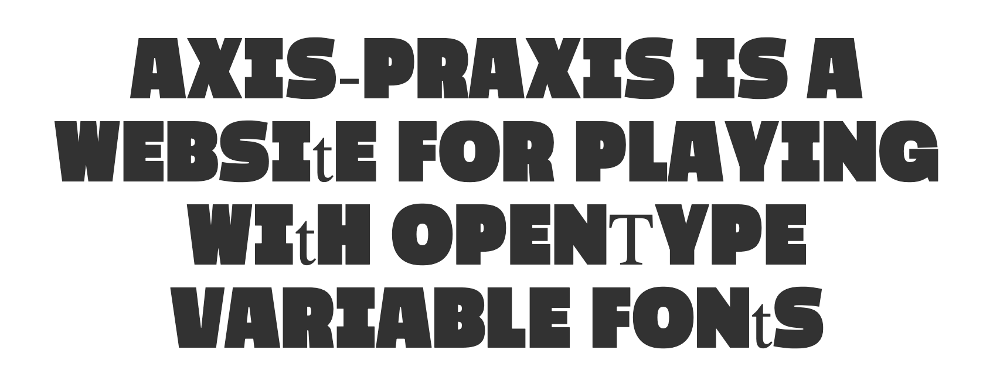

# VarFont Prep Workshop, Typographics 2019

This repo is an example project to demonstrate the use of [VarFont Prep](https://github.com/thundernixon/varfont-prep) in preparing font sources for the building of variable fonts.

VarFont Prep helps to prep font sources for building into prototype variable fonts. Because font sources have to be extremely clean and similar for to build into a variable font, VFP copies sources, then simply removes incompatibilities. The resulting files can then be built! This produces a variable font that isn't perfect, but *is* usable – allowing you to test your fonts while still making them, which is an essential part of the design process.

This demo contains an example type project which is a simplified version of [Mutator Sans, by @LettError](https://github.com/LettError/mutatorSans).

## Usage

### Step 1: Set up the project locally

Git Clone this repo. In a terminal, navigate to a folder for type projects, then clone.

```
cd Desktop

git clone https://github.com/thundernixon/varfont-prep-workshop.git

cd varfont-prep-workshop
```


You should use a Python virtual environment to build this project. If you've never set up a virtual environment before, [read more about it in this guide](https://packaging.python.org/tutorials/installing-packages/#creating-virtual-environments).

You can set up a Python 3 virtual environment with:

```bash
python3 -m venv ./venv
```

Here, `python3 -m venv` calls the virtual-environment-making module, then the `./venv` gives it a path to setup a virtual environment in (you could give a different path, but this is a conventional name).

Before you install dependencies or run the build, you need to activate the virtual environment with:

```bash
source venv/bin/activate
```

If you wish exit out of the virtual environment, you can use the command `deactivate` (just remember to start it up again if you come back). You can also simply close the terminal session.

Once you've activated the venv, install requirements by pointing pip to the `requirements.txt` file:

```bash
pip install -r requirements.txt
```

If all goes well, you will have set up a virtual environment and installed FontMake. If you've gotten lost, hopefully you're at the TypeLab – there will be plenty of people (including Stephen) who can help you catch up, now or after the workshop!

### Step 2: Test a fontmake build

Now that you've set up FontMake, let's do a test run. Point it to the designspace in an already

```
fontmake -o variable -m sources-clean/masters/mutatormathtest-varfontprep-2019_06_14-10_00_14/MutatorSans.designspace
```

This should generate a variable TTF in the folder `variable_ttf`. 

To test this, go to https://www.axis-praxis.org/, and drag and drop the font!

### Step 3: Use VarFont-Prep

Go to https://github.com/thundernixon/varfont-prep. Download this repo, then put it into your RoboFonts scripting folder (or better yet, clone it in, because it's a work-in-progress).

Now, find `varfont-prep` in your Scripts menu, and click it.

This brings up a file explorer. Find the following file in this workshop folder: `sources-slightly_messy/MutatorSans.designspace`.

It will load for a bit, then output a folder of duplicated and "fixed" masters.

### Step 4: Build the font!

```
fontmake -o variable -m <path/to/the/new/designspace/from/varfontprep>
```

Throw the new variable TTF into Axis-Praxis. You'll notice that the `T` is missing. Wonderful! It's incompatibility didn't prevent you from making a testable VF.


